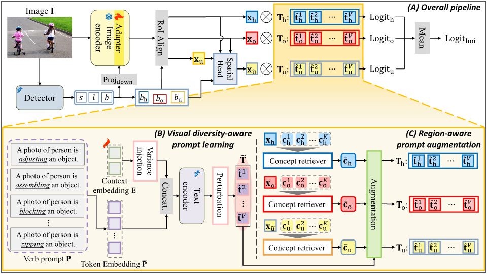

# [NeurIPS 2025] Visual Diversity and Region-aware Prompt Learning for Zero-shot HOI detection
Official PyTorch implementation of NeurIPS 2025 paper: **"Visual Diversity and Region-aware Prompt Learning for Zero-shot HOI Detection"**

<p align="center">
  
</p>


### Dataset 

Follow the process of [UPT](https://github.com/fredzzhang/upt).

The downloaded files should be placed as follows. Otherwise, please replace the default path to your custom locations.
```
|- VDRP
|   |- hicodet
|   |   |- hico_20160224_det
|   |       |- annotations
|   |       |- images
|   |- vcoco
|   |   |- mscoco2014
|   |       |- train2014
|   |       |- val2014
:   :      
```

### Dependencies

1. Follow the instructions to install dependencies.

```
git clone git@github.com:https://github.com/YangChanhyeong/VDRP.git

conda create --name vdrp python=3.9 # CLIP dependency
conda activate vdrp

pip install torch==1.8.0+cu111 torchvision==0.9.0+cu111 -f https://download.pytorch.org/whl/torch_stable.html
pip install matplotlib==3.6.3 scipy==1.10.0 tqdm==4.64.1
pip install numpy==1.24.1 timm==0.6.12
pip install fvcore

cd pocket
pip install -e .
```

2. Our code is built upon [CLIP](https://github.com/openai/CLIP). Install the local package of CLIP:
```
cd CLIP && python setup.py develop && cd ..
```

3. Download the CLIP weights to `checkpoints/pretrained_clip`.
```
|- VDRP
|   |- checkpoints
|   |   |- pretrained_clip
|   |       |- ViT-B-16.pt
|   |       |- ViT-L-14-336px.pt
:   :      
```

4. Download the weights of DETR and put them in `checkpoints/`.


| Dataset | DETR weights |
| --- | --- |
| HICO-DET | [weights](https://drive.google.com/file/d/1BQ-0tbSH7UC6QMIMMgdbNpRw2NcO8yAD/view?usp=sharing)  |
| V-COCO | [weights](https://drive.google.com/file/d/1AIqc2LBkucBAAb_ebK9RjyNS5WmnA4HV/view?usp=sharing) |


```
|- VDRP
|   |- checkpoints
|   |   |- detr-r50-hicodet.pth
|   |   |- detr-r50-vcoco.pth
:   :   :
```

### Pre-extracted Features

This repository provides pre-computed visual diversity statistics and concept embeddings used for our VDRP experiments.

#### Group covariance statistics for visual diversity-aware prompt learning: [Link](https://drive.google.com/drive/folders/1eyblEG7I82MyE4d69cTWhKft2LP-h67W?usp=drive_link)

```
data/
├── distribution/ # CLIP ViT-B/16
│ ├── non_rare_first/vdrp_group_cov.pt
│ ├── rare_first/vdrp_group_cov.pt
│ ├── unseen_object/vdrp_group_cov.pt
│ └── unseen_verb/vdrp_group_cov.pt
│
├── distribution_L/ # CLIP ViT-L/14
│ ├── non_rare_first/vdrp_group_cov.pt
│ ├── rare_first/vdrp_group_cov.pt
│ ├── unseen_object/vdrp_group_cov.pt
│ ├── unseen_verb/vdrp_group_cov.pt
│ ├── default/vdrp_group_cov.pt
│ └── vcoco/vdrp_group_cov.pt
:
```

#### Concept embeddings for region-aware prompt augmentation: [Link](https://drive.google.com/drive/folders/1pUrvzidAKofWeQD9yl53MCr_c2rRfMan?usp=drive_link)

```
data/verb_concepts/
├── human_concepts.pt
├── object_concepts.pt
├── context_concepts.pt
├── human_concepts_L.pt
├── object_concepts_L.pt
├── context_concepts_L.pt
├── human_concepts_vcoco.pt
├── object_concepts_vcoco.pt
└── context_concepts_vcoco.pt
```

### Train/Test

Please follow the commands in ```./scripts```.


### Model Zoo

| Method         |     Backbone      | Type  | Unseen↑ | Seen↑ | Full↑ | HM↑   |
|----------------|-------------------|-------|---------|-------|-------|-------|
|      VDRP      | ResNet50+ViT-B/16 | NF-UC | 36.45   | 31.60 | 32.57 | 33.85 |
|      VDRP      | ResNet50+ViT-B/16 | RF-UC | 31.29   | 34.41 | 33.78 | 32.77 |
|      VDRP      | ResNet50+ViT-B/16 | UO    | 36.13   | 32.84 | 33.39 | 34.41 |
|      VDRP      | ResNet50+ViT-B/16 | UV    | 26.69   | 33.72 | 32.73 | 29.80 |

### Model Weights

You can download the VDRP weights this link:
```
https://drive.google.com/drive/folders/1c0buK5W9fnF869C_zdtrEcyxsedSNoTv?usp=sharing
```

## Citation

If you find our paper and/or code helpful, please consider citing:
```

```

## Acknowledgement

We gratefully thank the authors from [UPT](https://github.com/fredzzhang/upt), [PViC](https://github.com/fredzzhang/pvic), [ADA-CM](https://github.com/ltttpku/ADA-CM/tree/main) and [CMMP](https://github.com/ltttpku/CMMP) for open-sourcing their code.