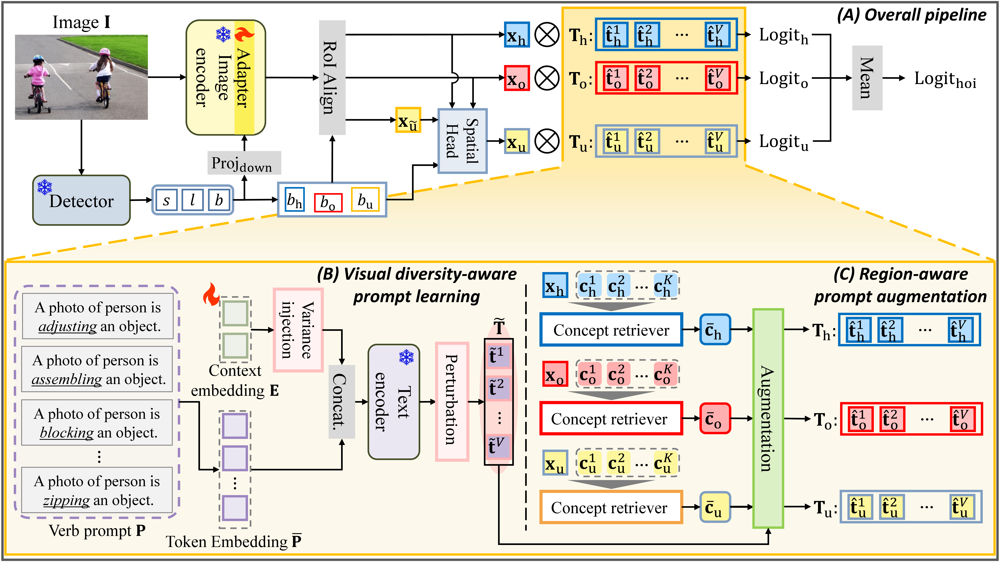

# [NeurIPS 2025] Visual Diversity and Region-aware Prompt Learning for Zero-shot HOI detection
Official PyTorch implementation of NeurIPS 2025 paper: **"Visual Diversity and Region-aware Prompt Learning for Zero-shot HOI Detection"**

<p align="center">
  
</p>


### Dataset 
Follow the process of [UPT](https://github.com/fredzzhang/upt).

The downloaded files should be placed as follows. Otherwise, please replace the default path to your custom locations.
```
|- VDRP
|   |- hicodet
|   |   |- hico_20160224_det
|   |       |- annotations
|   |       |- images
|   |- vcoco
|   |   |- mscoco2014
|   |       |- train2014
|   |       |- val2014
:   :      
```

### Dependencies
1. Follow the instructions to install dependencies.

```
git clone git@github.com:https://github.com/YangChanhyeong/VDRP.git

conda create --name vdrp python=3.9
conda activate vdrp

pip install torch==1.8.0+cu111 torchvision==0.9.0+cu111 -f https://download.pytorch.org/whl/torch_stable.html
pip install matplotlib==3.6.3 scipy==1.10.0 tqdm==4.64.1
pip install numpy==1.24.1 timm==0.6.12
pip install jupyter
```

2. Our code is built upon [CLIP](https://github.com/openai/CLIP). Install the local package of CLIP:
```
cd CLIP && python setup.py develop && cd ..
```

3. Download the CLIP weights to `checkpoints/pretrained_clip`.
```
|- VDRP
|   |- checkpoints
|   |   |- pretrained_clip
|   |       |- ViT-B-16.pt
|   |       |- ViT-L-14-336px.pt
:   :      
```

4. Download the weights of DETR and put them in `checkpoints/`.


| Dataset | DETR weights |
| --- | --- |
| HICO-DET | [weights](https://drive.google.com/file/d/1BQ-0tbSH7UC6QMIMMgdbNpRw2NcO8yAD/view?usp=sharing)  |
| V-COCO | [weights](https://drive.google.com/file/d/1AIqc2LBkucBAAb_ebK9RjyNS5WmnA4HV/view?usp=sharing) |


```
|- VDRP
|   |- checkpoints
|   |   |- detr-r50-hicodet.pth
|   |   |- detr-r50-vcoco.pth
:   :   :
```

### Pre-extracted Features

```
|- VDRP
|   |- data
|   |   |- distribution
|   |   |   |- non_rare_first
|   |   |   |   |-vdrp_group_cov.pt
|   |   |   |- rare_first
|   |   |   |   |-vdrp_group_cov.pt
|   |   |   |- unseen_object
|   |   |   |   |-vdrp_group_cov.pt
|   |   |   |- unseen_verb
|   |   |   |   |-vdrp_group_cov.pt
|   |   |- distribution_L
|   |   |   |- non_rare_first
|   |   |   |   |-vdrp_group_cov.pt
|   |   |   |- rare_first
|   |   |   |   |-vdrp_group_cov.pt
|   |   |   |- unseen_object
|   |   |   |   |-vdrp_group_cov.pt
|   |   |   |- unseen_verb
|   |   |   |   |-vdrp_group_cov.pt
|   |   |- verb_concepts
|   |   |   |- human_cues.pt
|   |   |   |- object_cues.pt
|   |   |   |- verb_cues.pt
|   |   |   |- human_cues_L.pt
|   |   |   |- object_cues_L.pt
|   |   |   |- verb_cues_L.pt
:   :      
```

### Train/Test

Please follow the commands in ```./scripts```.


### Model Zoo

| Method          | Type  | Unseen↑ | Seen↑ | Full↑ | HM↑   |
|-----------------|-------|---------|-------|-------|-------|
| VDRP (Ours)     | NF-UC | 36.45   | 31.60 | 32.57 | 33.85 |
| VDRP (Ours)     | RF-UC | 31.29   | 34.41 | 33.78 | 32.77 |
| VDRP (Ours)     | UO    | 36.13   | 32.84 | 33.39 | 34.41 |
| VDRP (Ours)     | UV    | 26.69   | 33.72 | 32.73 | 29.80 |

### Model Weights

You can download the VDRP weights from huggingface:
```

```

## Citation
If you find our paper and/or code helpful, please consider citing:
```

```

## Acknowledgement
We gratefully thank the authors from [UPT](https://github.com/fredzzhang/upt), [ADA-CM](https://github.com/ltttpku/ADA-CM/tree/main) and [CMMP](https://github.com/ltttpku/CMMP) for open-sourcing their code.
